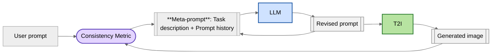

# OPT2I

Original paper: https://arxiv.org/abs/2403.17804

```mermaid
%%{init: {'theme': 'neutral', 'themeVariables': {'darkMode': false}, "flowchart" : { "curve" : "basis" } } }%%
flowchart LR
    %% Nodes
    U[User prompt]
    C([Consistency Metric])
    M[[**Meta-prompt**: Task description + Prompt history]]
    L[LLM]
    R[[Revised prompt]]
    T[T2I]
    G[[Generated image]]

    %% Flow
    U --> C
    T --> G --> C
    C --> M
    R --> M
    M --> L
    L --> R
    R --> T

    %% Styling
    classDef t2i fill:#b7e3a1,stroke:#2f7d32,stroke-width:2px;
    classDef llm fill:#cfe2ff,stroke:#1f5aa6,stroke-width:2px;
    classDef metric fill:#e3d4ff,stroke:#6a4fbf,stroke-width:2px;
    classDef stack fill:#f2f2f2,stroke:#999,stroke-width:1.5px;

    class T t2i;
    class L llm;
    class C metric;
    class R,G stack;

```

# TOC

- [OPT2I](#opt2i)
  - [t2i](./docs/t2i.md)
